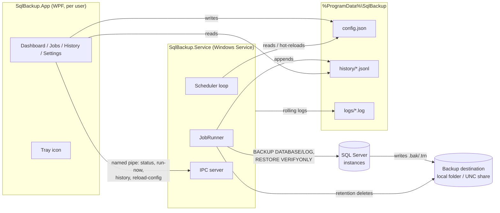

# SQL Server Backup Suite

A Windows desktop application paired with a background Windows Service that
periodically backs up one or more Microsoft SQL Server databases using native
`BACKUP DATABASE` / `BACKUP LOG` T-SQL — so it works from SQL Server Express
through Enterprise, with no dependency on SQL Server Agent.

* **SqlBackup.Service** — the backup engine. Runs as a Windows Service (works
  with nobody logged in), schedules jobs, executes backups with retry/backoff,
  enforces retention, writes history and logs, sends email alerts, and exposes
  a local named-pipe IPC endpoint.
* **SqlBackup.App** — the WPF control panel. Configure connections, jobs,
  schedules, retention and notifications; watch live status; browse history;
  run jobs on demand (through the service, or standalone when the service is
  stopped); install/manage the service; tray icon with failure balloons.
* **SqlBackup.Core** — shared library: models, config store, DPAPI secret
  protection, T-SQL generation, backup runner, scheduling, retention, history,
  IPC contract, email notifier, rolling file logger.



## Feature summary (v1)

* Multiple SQL Server connections — Windows or SQL authentication, passwords
  stored with **Windows DPAPI** (never plaintext), TLS options, "Test connection".
* **One-click dedicated backup login**: the connection editor can provision a
  SQL login named `iSQLBackup_[Title5]_[5 digits]` with a strong random
  password (generated, stored encrypted, never shown) and least-privilege
  backup rights — `db_backupoperator` everywhere, msdb history read, and
  `CREATE ANY DATABASE` for `RESTORE VERIFYONLY`. An existing `iSQLBackup_*`
  login for the same connection is reused with its password reset, so
  re-provisioning never litters the server.
* Jobs: any number of databases per job — explicitly listed, or **"all user
  databases" / "all databases" with exclusions**, discovered at run time so
  newly created databases are backed up automatically; **Full / Differential /
  Transaction log** backups; per-job destination (local or UNC), optional
  subfolder per database; timestamped file names (`Db_Full_20260718_023000.bak`).
* Schedules: every N minutes, daily at a time, weekly on chosen days, or a
  **cron expression** (Cronos, DST-safe); schedule preview in the editor;
  optional one-shot **catch-up** when the service was off at the due time.
* Retention per job: keep all, keep last N, or delete older than X days —
  only files matching this tool's naming pattern are ever touched, the newest
  backup always survives, and retention is **chain-aware**: a full backup is
  never deleted while surviving differential/log backups still depend on it.
* **RPO (missing-backup) alerts**: per job, "alert when there is no successful
  backup for N hours" — fires even when the job never runs at all (disabled
  job, stopped scheduler, broken cron), shows on the dashboard, and re-alerts
  daily while unresolved.
* **Off-site copies**: after a successful local backup, copy it to a **Windows
  file share (SMB/UNC), Azure Blob Storage, Amazon S3 (or any S3-compatible
  endpoint), or SFTP** with retries and an independent, also chain-aware
  retention policy on the remote side. An upload failure marks the run
  "off-site failed" and alerts, without invalidating the local backup.
* **Storage mode per job** — *local only*, *local + off-site* (both copies
  kept, each with its own retention), or *off-site only* (the destination
  folder is staging; the local file is deleted once the upload succeeds). A
  failed upload always keeps the local file, so a run never ends with no copy.
* **Reports**: 30-day success rate, run/failure counts, current full-backup
  footprint, bytes written, and per-database size trends (14-day mini chart),
  duration stats and growth percentage.
* Options per job: native compression, `CHECKSUM`, copy-only,
  **`RESTORE VERIFYONLY` after each backup**, automatic full-backup fallback
  when a differential/log has no base (plus a SIMPLE-recovery-model guard).
* Robustness: connect retry with exponential backoff; jobs never overlap
  themselves; failures land in history with the real SQL error; the service
  keeps running on bad config (last good config + visible error).
* Live control panel: service health card, next/last run per job, **Run now**,
  history browser with filtering and details, tray icon with quick actions and
  failure balloons; config changes hot-apply to the service (IPC push + file
  watch — no service restart).
* Alerts on **email (SMTP)**, a **generic JSON webhook** (payload is
  Slack/Teams/Discord-compatible out of the box) and the **Windows Event Log**
  (source `SqlBackup`), each with a test button; on-failure-only or always.
* **Config export/import** (Settings page): replicate a setup across machines.
  Secrets are never exported (they are DPAPI machine-bound); the import lists
  exactly which credentials must be re-entered.
* Service lifecycle from the app: install / start / stop / uninstall with UAC
  elevation, crash auto-restart configured via `sc failure`.
* Standalone mode: run any job directly inside the app when the service isn't
  available (same code path, recorded in the same history).

## Repository layout

```
src/SqlBackup.Core/        shared library (all business logic lives here)
src/SqlBackup.Service/     Windows Service host (scheduler + IPC server)
src/SqlBackup.App/         WPF control panel
tests/SqlBackup.Core.Tests unit tests + an in-process service E2E test
installer/SqlBackup.iss    Inno Setup 6 script
scripts/publish.ps1        publish both apps + compile the installer
docs/config-schema.md      data/config schema reference
docs/ipc-contract.md       IPC message reference
```

## Building

Requires the **.NET 8 SDK**.

```powershell
dotnet build SqlServerBackup.sln       # everything (Windows)
dotnet test  SqlServerBackup.sln       # 46 tests incl. an in-process service E2E
pwsh scripts/publish.ps1               # publish/Service + publish/App (+ installer if ISCC found)
```

Core, Service and the tests are cross-platform (`net8.0`) — CI on Linux works,
including the end-to-end IPC test (named pipes map to Unix sockets). The WPF app
targets `net8.0-windows`; it cross-compiles on Linux with Microsoft's SDK build
(`EnableWindowsTargeting` is already set) but only runs on Windows.

## Installing

**Installer (recommended):** build `installer/SqlBackup.iss` with Inno Setup 6
(`scripts/publish.ps1` does it when ISCC is installed). The installer copies the
service + app under `Program Files\SqlBackup`, creates `%ProgramData%\SqlBackup`
with user-writable permissions, registers **SqlBackupService** (auto-start,
crash auto-restart) and starts it.

**Manual / dev:** build, then use *Settings → Install service* inside the app
(elevates via UAC and points `sc create` at the built `SqlBackup.Service.exe`),
or register it yourself:

```bat
sc create SqlBackupService binPath= "\"C:\path\to\SqlBackup.Service.exe\"" start= auto
sc start SqlBackupService
```

The service also runs fine as a console app (`dotnet run` /
`SqlBackup.Service.exe`) for development.

## Quick start

1. Launch the **Control Panel** → *Settings* → **Install service** (skip if the
   installer already did it).
2. *Connections* → **Add** — server, auth mode, **Test connection**, Save.
3. *Backup Jobs* → **Add** — pick the connection, **Load databases** and tick
   what to back up, choose type/schedule/destination/retention, **Preview
   schedule**, **Validate destination**, Save.
4. Watch the *Dashboard*: next run, live "Running…" state, last result. Use
   **Run now** for an immediate backup; check *History* for file, size,
   duration, verification note or error text.

## Operational notes

* **Where files land:** `BACKUP ... TO DISK` is executed by the SQL Server
  *engine*, so the path is resolved on the **SQL Server host** under the SQL
  Server service account. For a local instance that's this machine; for a
  remote server use a UNC share that both the SQL Server service account (to
  write) and this machine (for retention/size checks) can reach. When the file
  isn't visible locally, the run still succeeds — history notes that size and
  retention were skipped.
* **Service account:** default is LocalSystem. For UNC destinations or Windows
  authentication against SQL Server, give the service a suitable account
  (`services.msc` → SqlBackupService → Log On) and grant it access.
* **Scheduling semantics:** occurrences are computed in the machine's local
  time zone (DST handled by Cronos). While a job runs, its next occurrence is
  computed from the run's start; an occurrence that comes due while the same
  job still runs is skipped, never queued. With *catch-up* enabled, a missed
  occurrence (service down) triggers exactly one run at startup.
* **Data folder:** everything shared is under `%ProgramData%\SqlBackup`
  (`config.json`, `history\`, `logs\`) — see `docs/config-schema.md`. Deleting
  a job never deletes its backup files.

## Security model (read this)

* SQL/SMTP passwords are DPAPI-encrypted at **machine scope** (both the user
  running the app and the service account must decrypt). Any local process that
  can read `config.json` could therefore decrypt them — prefer **Windows
  authentication**, and tighten the `%ProgramData%\SqlBackup` ACL if local
  users are not trusted.
* The IPC pipe is local-only; `Authenticated Users` may query status and start
  *configured* jobs, `Administrators`/`SYSTEM` have full control. Adjust the
  ACL in `IpcServer.CreateServerStream` for stricter environments.
* The installer grants `Users` modify rights on the data folder so the control
  panel works unelevated. Lock it down to a dedicated group if config changes
  must be admin-only.

## Troubleshooting

**"The server principal `NT AUTHORITY\SYSTEM` is not able to access the database
`X` under the current security context"** (or `BACKUP DATABASE permission
denied` / `Login failed`) — the job used **Windows authentication inside the
service**, so it authenticated as the **service account** (LocalSystem by
default), not as you. Standalone runs from the app use *your* account, which is
why the same job can succeed in the app and fail in the service. Fix one of:

1. Run the service as an account with access: `services.msc` →
   *SQL Server Backup Service* → *Log On* → "This account", then restart it.
2. Grant the service account backup rights (least privilege), per database:
   ```sql
   CREATE USER [NT AUTHORITY\SYSTEM] FOR LOGIN [NT AUTHORITY\SYSTEM];
   ALTER ROLE [db_backupoperator] ADD MEMBER [NT AUTHORITY\SYSTEM];
   ```
   (`ALTER SERVER ROLE [sysadmin] ADD MEMBER [NT AUTHORITY\SYSTEM];` also works
   but hands the whole instance to every LocalSystem process.)
3. Switch the connection profile to SQL authentication with a login that has
   `db_backupoperator` in each database — easiest via **Connections → Edit →
   "Create dedicated backup login"**, which provisions an `iSQLBackup_*` login
   with the right permissions and stores its generated password automatically
   (requires mixed-mode authentication on the server).

The Dashboard shows which account the engine runs as ("running as …"), and
permission failures in History carry this guidance inline.

**"Service install failed (exit code 1053)" / "did not respond to the start
request"** — Windows registered the service but the process never launched or
crashed before reporting in. Check `%ProgramData%\SqlBackup\logs` for a
`service-*.log`: if none was written, the process never started. Usual causes:

1. The service exe was registered from an incomplete or per-user folder (for
   example a ClickOnce cache under `AppData\Local\Apps\2.0\...`) that lacks
   `SqlBackup.Service.dll` and the rest of the payload. The app's *Install
   service* now copies the full service folder to
   `Program Files\SqlBackup\Service` and registers that copy, and refuses
   folders where the payload is missing. Don't distribute this suite via
   ClickOnce — it is per-user by design; use the Inno Setup installer.
2. Framework-dependent build without the .NET 8 runtime installed — publish
   self-contained (`dotnet publish -c Release -r win-x64 --self-contained
   true`) or install the runtime.
3. A startup crash — the service log (or Windows Event Viewer → Application)
   has the reason.

**"The service accepted the connection but closed it without responding" /
"Service running, IPC unavailable"** — the service process is alive but fails
between reading a request and writing the reply. Check
`%ProgramData%\SqlBackup\logs\service-*.log` for `IPC request read failed` /
`IPC response write failed` lines — the dashboard also shows the last IPC
error. Usual causes:

1. **Stale service build**: the registered service exe (see `sc qc
   SqlBackupService` → BINARY_PATH_NAME) is from an older install location or
   older version than the app. Reinstall via *Settings → Install service* so
   the current build is copied to `Program Files\SqlBackup\Service`.
2. **Trimmed publish**: publishing the service with IL trimming breaks the
   reflection-based JSON serializers (the service starts but cannot answer
   anything). The project now sets `PublishTrimmed=false` to prevent this —
   don't re-enable it in a publish profile.
3. Binaries replaced underneath a running service — always stop the service
   before republishing over its folder, then start it again.

## Roadmap (not in v1, by design)

Cloud destinations (Azure Blob/S3/SFTP) after local backup, restore workflow UI
(including point-in-time chain calculation), backup-size/duration dashboards,
Slack/Teams/webhook alerts, pre/post-run hooks, bandwidth throttling for UNC
targets, CLI companion, role-based access, audit log of config changes, and a
health endpoint for Prometheus/Zabbix. The `Core`/`Service` split was designed
so these bolt on without reworking the engine.
